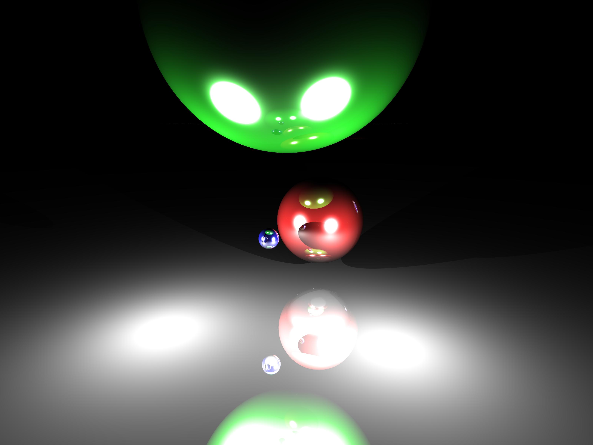

# A software based raytracer in Kotlin. 
## Because why not?!

### Supports:
- Diffuse, specular and reflective materials
- Point lights
- Spheres
- Super sampling anti-aliasing
- Configurable camera

Example:

**Written for fun. Code is not optimized or checked for correctness.
Yes this can be used on Android. Draw the pixels to a canvas, and you're done.**

_Apache 2.0 License_